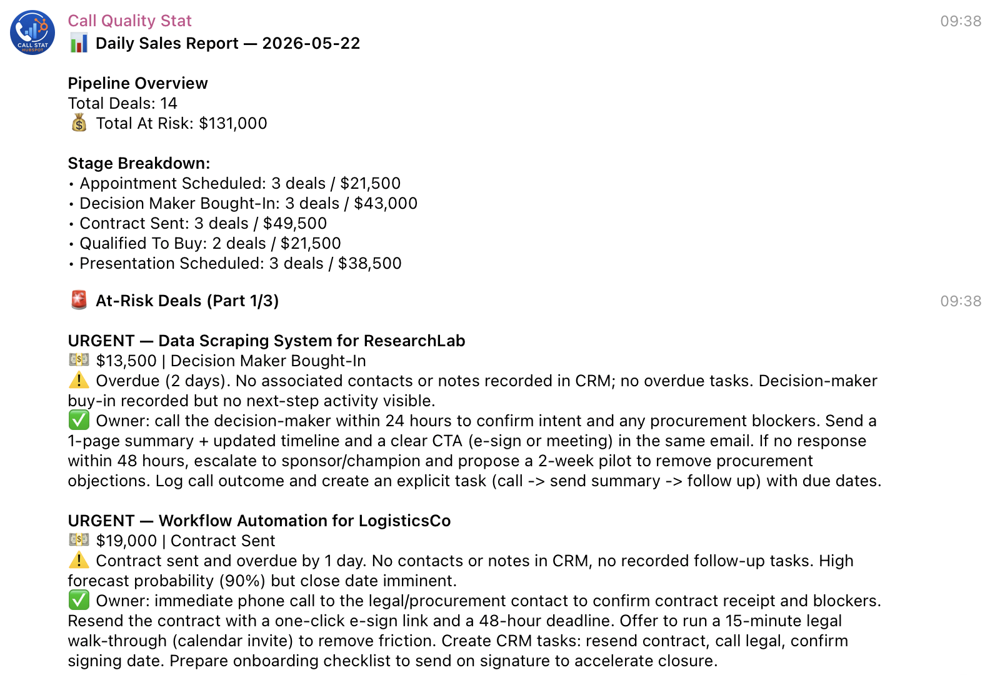
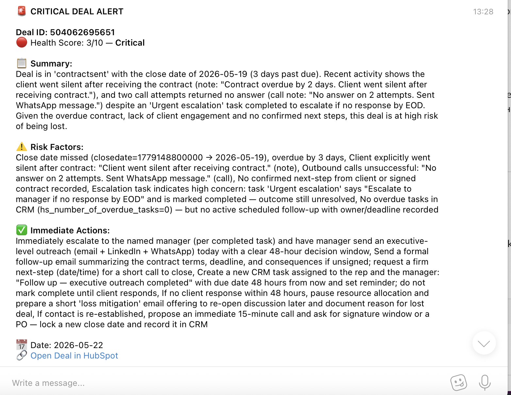
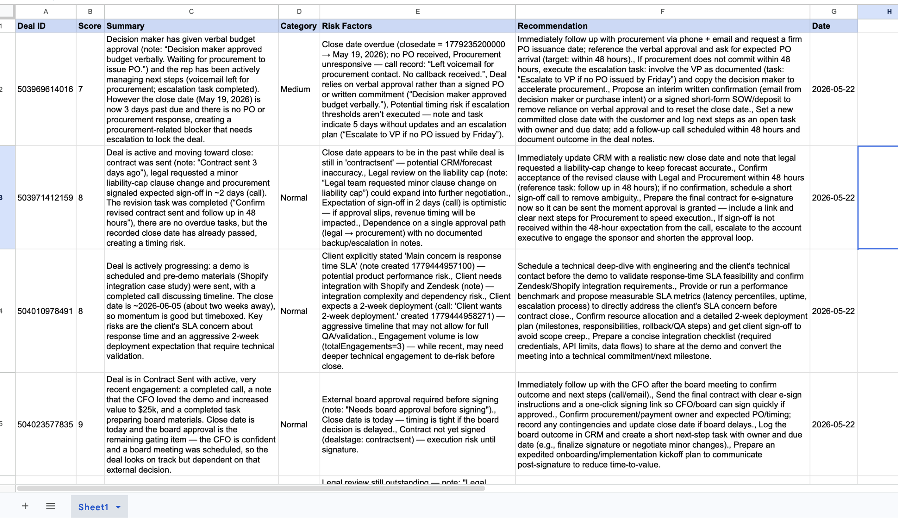
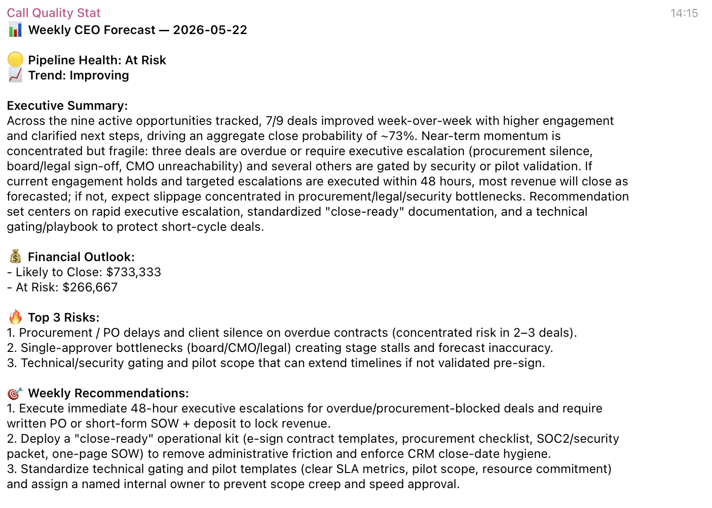

# 🧠 Sales Intelligence System
### From Daily Pipeline Report to Strategic CEO Forecast

An end-to-end AI automation system built on n8n that analyzes a B2B sales pipeline, scores deal health, and delivers automated reports via Telegram — with zero manual work.

---

## 📐 Architecture

```
PART 1 — Daily (9:10 AM)
Schedule Trigger → HubSpot → Code Node → AI Agent → Message Splitter → Telegram

PART 2 — Weekly (Monday 10:00 AM)
Schedule Trigger → HubSpot → Loop Over Items → If (stage filter)
→ Sub-workflow (engagements) → AI Agent → Google Sheets → Switch → Telegram

PART 2B — Sub-workflow
Execute Trigger → HubSpot Engagements API → Code Node (structure data)

PART 3 — Weekly (Friday 19:00)
Schedule Trigger → Google Sheets → Aggregate → AI Agent → Telegram
```

---

## 🔄 Workflows

### Part 1 — Daily Sales Report
Pulls all active deals from HubSpot, identifies stuck deals, and sends AI-generated prioritized report to Telegram every morning.

**Key mechanic:** AI Agent receives only deal IDs and calls the `Get Deal` tool itself for each at-risk deal. It decides what to investigate — the workflow doesn't pre-load all data. This keeps token usage efficient and mimics how a real analyst works.

### Part 2 — Deal Health Alerts
Loops through every active deal weekly. Filters stuck stages. Fetches engagement history (notes, calls, tasks) via sub-workflow. AI Agent scores each deal 1-10. Stores results in Google Sheets. Fires Telegram alerts for Critical (≤4) and Medium (≤7) deals only.

**Key mechanic:** Switch node order is Critical → Medium → Normal. First match wins — order is not cosmetic.

### Part 2B — Sub-workflow (Engagements)
Isolated workflow that fetches all HubSpot engagements for a single deal ID. Separated from main workflow for clean debugging and reusability.

### Part 3 — CEO Weekly Forecast
Reads accumulated Deal Health data from Google Sheets (not HubSpot directly). Aggregates all rows. AI Agent produces executive briefing: pipeline health status, revenue at risk, revenue likely to close, top 3 risks, weekly recommendations.

---

## 🛠 Tech Stack

| Tool | Version / Plan | Role |
| --- | --- | --- |
| n8n | Self-hosted | Workflow automation |
| HubSpot | Free tier | CRM data source |
| OpenAI | GPT-5 mini | AI analysis and scoring |
| Google Sheets | Free | Analytics storage |
| Telegram Bot API | Free | Report delivery |

---

## 🚀 Setup

### Prerequisites
- n8n self-hosted instance running
- HubSpot account (free tier works)
- OpenAI API key
- Telegram bot token + chat ID
- Google account with Sheets access

### Step 1 — HubSpot credentials
1. HubSpot → Settings → Integrations → Create Service Key
2. Scopes needed: `crm.objects.deals.read`, `crm.objects.contacts.read`, `crm.objects.owners.read`
3. Add as **HubSpot App Token** credential in n8n

### Step 2 — Google Sheets
Create a sheet named `Deal Health Tracker` with these exact headers in row 1:
```
Deal ID | Score | Summary | Category | Risk Factors | Recommendation | Date
```

### Step 3 — Telegram Bot
1. Message @BotFather → `/newbot` → copy token
2. Add as Telegram credential in n8n
3. Get your Chat ID: send any message to your bot → hit `api.telegram.org/bot<TOKEN>/getUpdates`

### Step 4 — Import workflows
Import in this order:
1. `part2-deal-engagements-subworkflow.json` ← import first, activate it
2. `part1-daily-sales-report.json`
3. `part2-deal-health-alerts.json`
4. `part3-ceo-forecast.json`

Update credentials in every node after import.

### Step 5 — Seed test data (optional)
If you want to test with realistic data, use the HubSpot API to create deals across pipeline stages:
```bash
curl -X POST "https://api.hubapi.com/crm/v3/objects/deals" \
  -H "Authorization: Bearer YOUR_TOKEN" \
  -H "Content-Type: application/json" \
  -d '{"properties":{"dealname":"Test Deal","amount":"10000","dealstage":"contractsent","closedate":"2026-05-01"}}'
```

---

## ⚠️ Important Notes

**Switch node order in Part 2**
Conditions must be in this exact order or routing breaks:
1. Score ≤ 4 → Critical
2. Score ≤ 7 → Medium
3. Score ≤ 10 → Normal

**Sub-workflow must be activated first**
Part 2 calls the sub-workflow via Execute Sub-workflow node. If the sub-workflow is inactive, Part 2 will fail silently.

**Google Sheets Append or Update**
Match column is `Deal ID`. Running Part 2 multiple times updates existing rows — no duplicates.

**HubSpot Engagements API**
Uses the legacy `/engagements/v1/` endpoint which returns notes, calls, and tasks in a single request. No separate scopes needed beyond basic CRM read access.

**Token usage**
HubSpot returns deeply nested property objects. With 9+ at-risk deals, Part 1 can hit TPM limits on higher-tier models. GPT-5 mini handles this efficiently.

---

## 📁 Repository Structure

```
├── workflows/
│   ├── part1-daily-sales-report.json
│   ├── part2-deal-health-alerts.json
│   ├── part2-deal-engagements-subworkflow.json
│   └── part3-ceo-forecast.json
├── screenshots/
│   ├── part1-workflow.png
│   ├── part2-workflow.png
│   ├── part2-subworkflow.png
│   ├── part3-workflow.png
│   ├── telegram-daily-report.png
│   ├── telegram-critical-alert.png
│   ├── telegram-medium-alert.png
│   ├── telegram-ceo-forecast.png
│   └── google-sheets-data.png
├── docs/
│   ├── system-prompt-part1.md
│   ├── system-prompt-part2.md
│   ├── system-prompt-part3.md
│   ├── json-schema-part1.md
│   └── json-schema-part2.md
└── README.md
```

---

## 📸 Screenshots

### Part 1 — Daily Report (Telegram)


### Part 2 — Critical Alert (Telegram)


### Part 2 — Google Sheets


### Part 3 — CEO Forecast (Telegram)


---

## 📄 License

MIT — free to use, adapt, and deploy for client projects.
